## Contents

-   [Introduction and Background](#introduction-and-background) –
    [Objectives](#objectives)
-   [Data Preparation](#data-preparation)
-   [Data Processing/Cleaning](#data-processingcleaning)
-   [Create two dummy
    variables](#create-two-dummy-variables-for-whether-each-participant-is)
-   [How is the mobile money divided between the three
    companies?](#how-is-the-mobile-money-market-divided-between-the-three-companies)
-   [Difference in the share of customers who have experienced failed
    mobile money
    transactions](#is-there-a-difference-in-the-share-of-customers-who-have-experienced-failed-mobile-money-transactions-in-rural-and-urban-villages-if-so-is-it-statistically-significant)
    – [Findings](#findings) – [Hypothesis Testing](#hypothesis-testing)
-   [What variables are good predictors that someone will cancel their
    mobile money
    account?](#what-variables-are-good-predictors-that-someone-will-cancel-their-mobile-money-account)
-   [What causes a customer to stop using their mobile money
    account?](#what-causes-a-customer-to-stop-using-their-mobile-money-account)
-   [Key findings and Summary](#key-findings-and-summary) –
    [Recommendations](#recommendations) – [Limitations of the
    Data](#limitations-of-the-data)

## Introduction and background

A company has recently finished the data collection for a project on the
use of Mobile Money services and the experiences of Mobile Money
customers in three districts of Kenya.

### Objectives

The aim of the analysis is to identify and interpret issues that
negatively affect mobile money customers. This will be discussed by the
Specialist Advisory Board for the study which consists of
representatives from the National Bank of Kenya, the Utilities
Regulatory Authority and NGO’s focusing on access to digital financial
services and associated consumer protection issues.

The research manager wants the following points addressed:

1.  Format the data so that there is now one observation per
    participant.

2.  Create two dummy variables for whether each participant is: i)
    financially excluded and ii) digitally financially included.
    Determine the overall rates of financial exclusion and digital
    financial inclusion for the combined population of the three
    districts?

    1.  Financial exclusion is defined as not having registered for any
        type of financial account including accounts with: Mobile money
        operators, banks, micro-finance institutions (MFI’s), savings
        and credit cooperative organisations (SACCO’s) and village
        savings and loan associations (VSLA’s).

    2.  Digital financial inclusion is defined as having at least one
        registered account with a mobile money operator or an online
        bank account.

3.  Describe in a few short paragraphs how the mobile money market is
    divided between the three companies.

4.  Understand the difference in the share of customers who have
    experienced failed mobile money transactions in rural and urban
    villages. Is the difference statistically significant?

5.  What variables are good predictors that someone will cancel their
    mobile money account? What causes a customer to stop using their
    mobile money account? (Including how strong the evidence is).

## Data Preparation

The data is publicly available on George Mwangi’s git hub page
<https://github.com/mwangi-george/Data_Analysis_Case_Study>

## Data Processing/Cleaning

For the data to be useful and accurate enough to answer the questions
asked, it needs to be cleaned. After downloading the data csv file, I
started the data cleaning process in Google Sheets using the following
steps: \* I created separate columns for each of the six (6) account
types and three (3) companies \* Rows with particular account types were
set to the boolean “TRUE/FALSE” values \* I imported the file to RStudio
in order to convert any logical columns to character type \* In RStudio,
I changed all cells in account types with “FALSE” to blank cells after
which I exported the resulting data frame to a csv file in order to
continue the cleaning process in Google Sheets. The R code used is
highlighted under

    mmdf$mobile_money <- gsub('FALSE', '', mmdf$mobile_money)
    mmdf$bank_account <- gsub('FALSE', '', mmdf$bank_account)
    mmdf$vsla_account <- gsub('FALSE', '', mmdf$vsla_account)
    mmdf$sacco_account <- gsub('FALSE', '', mmdf$sacco_account)
    mmdf$online_bank_account <- gsub('FALSE', '', mmdf$online_bank_account)
    mmdf$no_account <- gsub('FALSE', '', mmdf$no_account)

    write.csv(mmdf,"/home/omotolaolasope/Desktop/Data_Analysis/mobile_money_case_study/mmdf.csv", row.names = FALSE)

-   In Sheets, I merged all rows with identical ’hhid’s together and
    deleted columns that are not needed
-   I then exported the sheet to csv and imported the file back into
    RStudio for further cleaning

<!-- -->

    mmdf <- read.csv('mmdf.csv')

-   In Rstudio, I renamed some columns to ease understanding of the
    variables

<!-- -->

    colnames(mmdf)[10] ="hh_location" #urban
    colnames(mmdf)[22] ="undrstd_terms_nd_cond"
    colnames(mmdf)[24] ="taken_mm_loan"
    colnames(mmdf)[25] ="ntwrk_unavailable_mm_txn"
    colnames(mmdf)[26] ="clear_about_txn_fees"
    colnames(mmdf)[27] ="txn_ever_failed"
    colnames(mmdf)[28] ="agent_ever_not_had_enough_cash"
    colnames(mmdf)[29] ="have_copy_of_terms_nd_cond"
    colnames(mmdf)[30] ="undrstd_hw_nd_whr_to_complain"
    colnames(mmdf)[31] ="had_issue_reslvd_after_complaint"
    colnames(mmdf)[32] ="understand_data_mm_providers_collect"
    colnames(mmdf)[33] ="been_victim_of_fraud"

    colnames(mmdf)

-   I exported the resulting data frame to a csv file in order to
    finalise the cleaning process in Google Sheets. I then exported the
    sheet to csv and imported the file into RStudio for Analysis

## Analysis With R

### Upload and loading CSV file to R

``` r
mmdf3 <- read.csv('mmdf3.csv')
raw_df <- read.csv('mobile_money_data.csv')
```

### Installing and loading packages and libraries

### Exploring the data

Take a look at the data.

``` r
str(mmdf3)
```

    ## 'data.frame':    1205 obs. of  33 variables:
    ##  $ hhid                                : int  1001 1002 1003 1004 1005 1006 1007 1008 1009 1010 ...
    ##  $ mobile_money                        : logi  TRUE NA TRUE TRUE TRUE NA ...
    ##  $ bank_account                        : logi  TRUE NA TRUE TRUE NA NA ...
    ##  $ vsla_account                        : logi  TRUE TRUE NA NA TRUE TRUE ...
    ##  $ sacco_account                       : logi  NA TRUE NA TRUE NA NA ...
    ##  $ online_bank_account                 : logi  NA NA NA NA NA NA ...
    ##  $ no_account                          : logi  NA NA NA NA NA NA ...
    ##  $ weight                              : chr  "145.94" "122.91" "760.46" "433.96" ...
    ##  $ district                            : chr  "District_A" "District_B" "District_A" "District_A" ...
    ##  $ hh_location                         : chr  "Urban" "Rural" "Urban" "Rural" ...
    ##  $ gender                              : chr  "male" "male" "male" "male" ...
    ##  $ age                                 : int  32 32 30 68 28 36 66 52 37 45 ...
    ##  $ hh_members                          : int  1 4 8 4 2 7 7 5 5 7 ...
    ##  $ highest_grade_completed             : chr  "primary 6" "primary 3" "secondary 6" "primary 6" ...
    ##  $ mm_account_cancelled                : chr  "no" "yes" "no" "no" ...
    ##  $ prefer_cash                         : chr  "yes" "yes" "yes" "yes" ...
    ##  $ mm_trust                            : chr  "no" "no" "no" "no" ...
    ##  $ mm_account_telco_1                  : chr  "Company_A" "" "Company_A" "Company_A" ...
    ##  $ mm_account_telco_2                  : chr  "Company_B" "" "" "" ...
    ##  $ mm_account_telco_3                  : chr  "" "" "" "" ...
    ##  $ mm_account_telco_main               : chr  "Company_A" "" "" "" ...
    ##  $ undrstd_terms_nd_cond               : chr  "yes" "" "yes" "no" ...
    ##  $ agent_trust                         : chr  "no" "no" "no" "no" ...
    ##  $ taken_mm_loan                       : chr  "" "" "" "" ...
    ##  $ ntwrk_unavailable_mm_txn            : chr  "yes" "yes" "no" "no" ...
    ##  $ clear_about_txn_fees                : chr  "yes" "yes" "yes" "no" ...
    ##  $ txn_ever_failed                     : chr  "no" "yes" "yes" "no" ...
    ##  $ agent_ever_not_had_enough_cash      : chr  "yes" "no" "yes" "no" ...
    ##  $ have_copy_of_terms_nd_cond          : chr  "no" "no" "no" "no" ...
    ##  $ undrstd_hw_nd_whr_to_complain       : chr  "yes" "no" "yes" "yes" ...
    ##  $ had_issue_reslvd_after_complaint    : chr  "" "" "yes" "" ...
    ##  $ understand_data_mm_providers_collect: chr  "yes" "no" "yes" "no" ...
    ##  $ been_victim_of_fraud                : chr  "no" "no" "no" "no" ...

``` r
#Convert any logical columns to character type
mmdf3 <- data.frame(lapply(mmdf3, function(x) if(is.logical(x)) { 
  return(as.character(x))
} else {  
  return(x) 
}
), stringsAsFactors=FALSE)
```

### Change all cells in account types with “NA” to ‘FALSE’

``` r
mmdf3$mobile_money <- mmdf3$mobile_money %>% replace_na('FALSE')
mmdf3$bank_account <- mmdf3$bank_account %>% replace_na('FALSE')
mmdf3$vsla_account <- mmdf3$vsla_account %>% replace_na('FALSE')
mmdf3$sacco_account <- mmdf3$sacco_account %>% replace_na('FALSE')
mmdf3$online_bank_account <- mmdf3$online_bank_account %>% replace_na('FALSE')
mmdf3$no_account <- mmdf3$no_account %>% replace_na('FALSE')
```

### Grided Histogram of distribution of account types

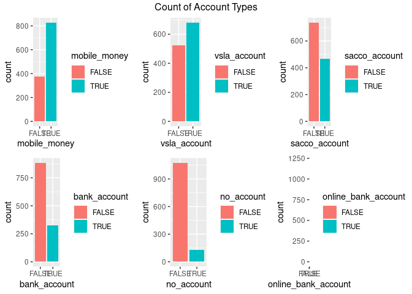

#### Combined distribution of account types

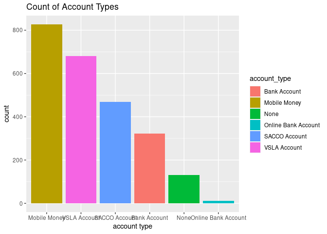

## Create two dummy variables for whether each participant is:

## i) financially excluded and ii) digitally financially included.

``` r
mmdf2 <- transform(mmdf3, fin_excl = ifelse(no_account == "TRUE", TRUE, FALSE))

mmdf2 <- transform(mmdf2, dig_fin_incl = ifelse((mobile_money == "TRUE") | (online_bank_account =="TRUE"), TRUE, FALSE))
```

### Get overall rate of financial exclusion

``` r
rate_fin_excl <- mmdf2 %>% 
  group_by(fin_excl) %>% 
  summarise(n = n())

rate_fin_excl$fin_excl_percen <- 100*(rate_fin_excl$n/sum(rate_fin_excl$n))

ggplot(aes(x = reorder(fin_excl, fin_excl_percen), y = fin_excl_percen, fill = fin_excl), data = rate_fin_excl) +
  geom_bar(stat="identity") +
  labs(x = 'financially excluded', y = 'percent', title="overall rate of financial exclusion") +
  guides(fill=guide_legend(title="Financially excluded"))
```

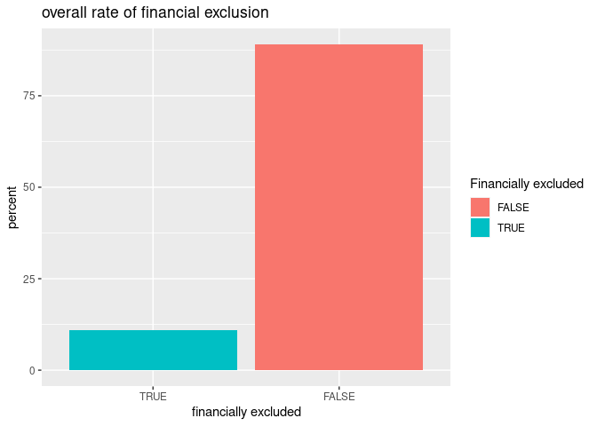

``` r
#create pie chart of rates of financial exclusion
pie(rate_fin_excl$fin_excl_percen,
    labels = paste0(round(rate_fin_excl$fin_excl_percen, 2), "%"),
    main = 'overall rate of financial exclusion')
```

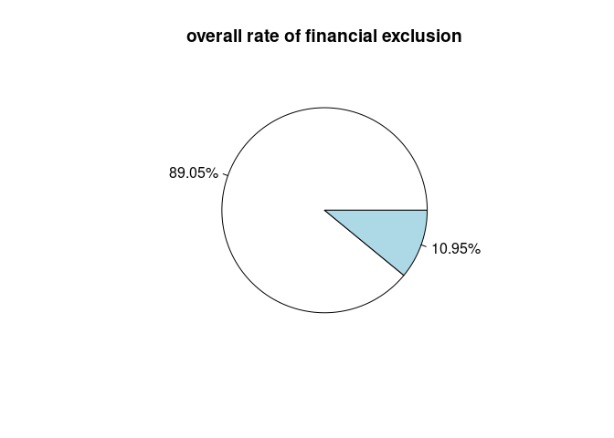

### Get overall rate of digital financial inclusion

``` r
dig_fin_inclu <- mmdf2 %>% 
  group_by(dig_fin_incl) %>% 
  summarise(n = n())

dig_fin_inclu$dig_fin_inclu_percen <- 100*(dig_fin_inclu$n/sum(dig_fin_inclu$n))

ggplot(aes(x = reorder(dig_fin_incl, dig_fin_inclu_percen), y = dig_fin_inclu_percen, fill = dig_fin_incl), data = dig_fin_inclu) +
  geom_bar(stat="identity") +
  labs(x = 'digital finance included', y = 'percent', title="overall rate of digital financial inclusion") +
  guides(fill=guide_legend(title="Digital Financially Included"))
```

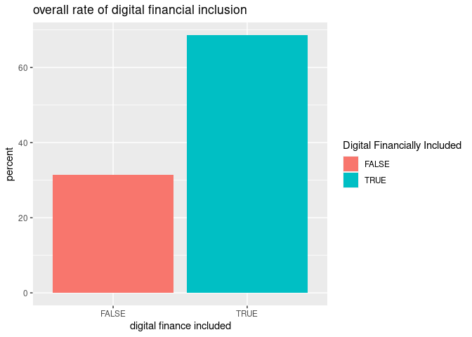

``` r
#create pie chart of rates of financial exclusion
pie(dig_fin_inclu$dig_fin_inclu_percen,
    labels = paste0(round(dig_fin_inclu$dig_fin_inclu_percen, 2), "%"),
    main = 'overall rate of digital financial inclusion')
```

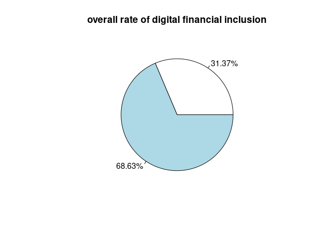

## How is the mobile money market divided between the three companies?

### Seperate columns with the telcos for easier analysis

``` r
col_telcos <- mmdf2 %>% 
  select(mm_account_telco_1, mm_account_telco_2, mm_account_telco_3)
```

### Group the data by the telcos and get the count of each

``` r
count_mm_telco <- mmdf2 %>% 
  group_by(mm_account_telco_1, mm_account_telco_2, mm_account_telco_3) %>% 
  summarise(n = n())

print(count_mm_telco)
```

    ## # A tibble: 8 × 4
    ## # Groups:   mm_account_telco_1, mm_account_telco_2 [7]
    ##   mm_account_telco_1 mm_account_telco_2 mm_account_telco_3     n
    ##   <chr>              <chr>              <chr>              <int>
    ## 1 ""                 ""                 ""                   380
    ## 2 "Company_A"        ""                 ""                   218
    ## 3 "Company_A"        "Company_B"        ""                   331
    ## 4 "Company_A"        "Company_B"        "Company_C"           25
    ## 5 "Company_A"        "Company_C"        ""                    23
    ## 6 "Company_B"        ""                 ""                   191
    ## 7 "Company_B"        "Company_C"        ""                    23
    ## 8 "Company_C"        ""                 ""                    14

### Get the sum of mobile money tel_co users for each company

``` r
sum_mm_telco_users <- data.frame(company = c('company A', 'company B', 'company C'),
                 total_users=c(sum(col_telcos == "Company_A"), sum(col_telcos == "Company_B"), sum(col_telcos == "Company_C")))

print(sum_mm_telco_users)
```

    ##     company total_users
    ## 1 company A         597
    ## 2 company B         570
    ## 3 company C          85

``` r
ggplot(aes(x = company, y = total_users), data = sum_mm_telco_users) +
  geom_bar(stat = 'identity') +
  labs(x = 'mobile money company', y = 'mobile money customers', title="Mobile money market between the three companies")
```

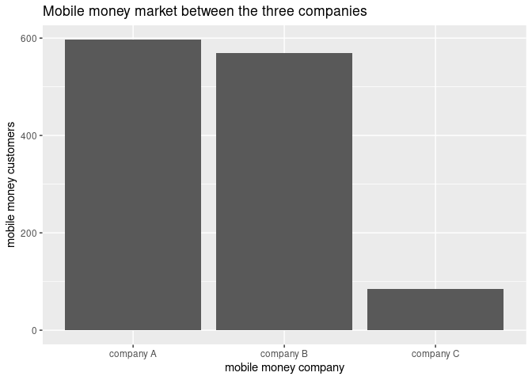

#### Findings

From the resulting table, company A has the most customers with 597
mobile money customers, company B has 570 customers and company C has
the least with 85 customers

## Is there a difference in the share of customers who have experienced failed mobile money transactions in rural and urban villages? If so, is it statistically significant?

### Seperate columns for easier analysis

``` r
df.mm_txn <- mmdf2 %>% 
  select(hh_location, mobile_money, txn_ever_failed, had_issue_reslvd_after_complaint)
```

### Know the count of customers at each location

``` r
count_hhlocation <- df.mm_txn %>% 
  group_by(hh_location) %>% 
  summarise(number_of_residents = n())

print(count_hhlocation)
```

    ## # A tibble: 2 × 2
    ##   hh_location number_of_residents
    ##   <chr>                     <int>
    ## 1 Rural                       940
    ## 2 Urban                       265

``` r
ggplot(aes(x = hh_location, fill = mobile_money), data = df.mm_txn) +
  geom_histogram(stat="count")
```

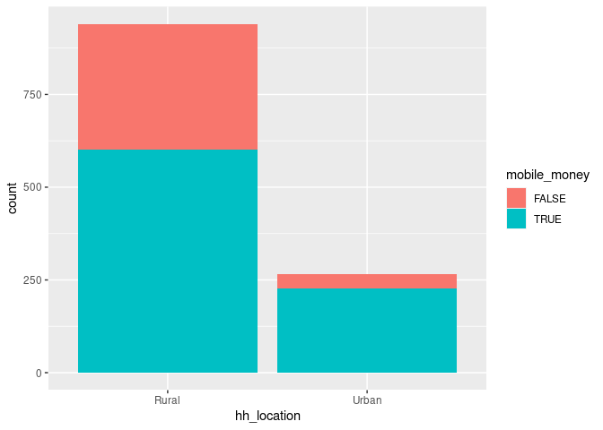

#### Customers in the rural areas are significantly more than those in the urban areas

### Determine the percentage of failed transactions per location

``` r
#seperate columns for easier analysis
df.txn <- mmdf2 %>% 
  select(hh_location, txn_ever_failed, had_issue_reslvd_after_complaint)

grp_txn <- df.txn %>% 
  group_by(hh_location, txn_ever_failed) %>% 
  summarise(number = n())

#Filter Rural transactions
rural_txns <- grp_txn %>% 
  filter(hh_location == 'Rural')

#get percentage and create new column for it
rural_txns$txn_percen <- round(100*(rural_txns$number/sum(rural_txns$number)), 2)
print(rural_txns)
```

    ## # A tibble: 3 × 4
    ## # Groups:   hh_location [1]
    ##   hh_location txn_ever_failed number txn_percen
    ##   <chr>       <chr>            <int>      <dbl>
    ## 1 Rural       ""                 196       20.8
    ## 2 Rural       "no"               589       62.7
    ## 3 Rural       "yes"              155       16.5

``` r
#graph of rural transactions
ruralG <- ggplot(aes(x = txn_ever_failed, y = txn_percen, fill = txn_ever_failed), data = rural_txns) +
  geom_bar(stat = 'identity') +
  ylim(0, 100) +
  labs(x = 'Has Transaction Ever Failed', y = 'Percentage (%)', title="Graph showing failed transaction percentages in Rural location") +
  scale_fill_manual(values = c("#ADD8E6", "#F93B19", "green"),
                    labels = c("N/A", "No","Yes")) +
  guides(fill=guide_legend(title="Has transaction \never failed?"))

#Filter Urban transactions
urban_txns <- grp_txn %>% 
  filter(hh_location == 'Urban')

#get percentage and create new column for it
urban_txns$txn_percen <- round(100*(urban_txns$number/sum(urban_txns$number)), 2)
print(urban_txns)
```

    ## # A tibble: 3 × 4
    ## # Groups:   hh_location [1]
    ##   hh_location txn_ever_failed number txn_percen
    ##   <chr>       <chr>            <int>      <dbl>
    ## 1 Urban       ""                  26       9.81
    ## 2 Urban       "no"               154      58.1 
    ## 3 Urban       "yes"               85      32.1

``` r
#graph of urban transactions
urbanG <- ggplot(aes(x = txn_ever_failed, y = txn_percen, fill = txn_ever_failed), data = urban_txns) +
  geom_bar(stat = 'identity') +
  ylim(0, 100) +
  labs(x = 'Has Transaction Ever Failed', y = 'Percentage (%)', title="Graph showing failed transaction percentages in Urban location") +
  scale_fill_manual(values = c("#ADD8E6", "#F93B19", "green"),
                    labels = c("N/A", "No","Yes")) +
  guides(fill=guide_legend(title="Has transaction \never failed?"))

#compare percentages for both regions
grid.arrange(ruralG, urbanG, ncol=2, top = 'Compare percentage Transactions by Location')
```

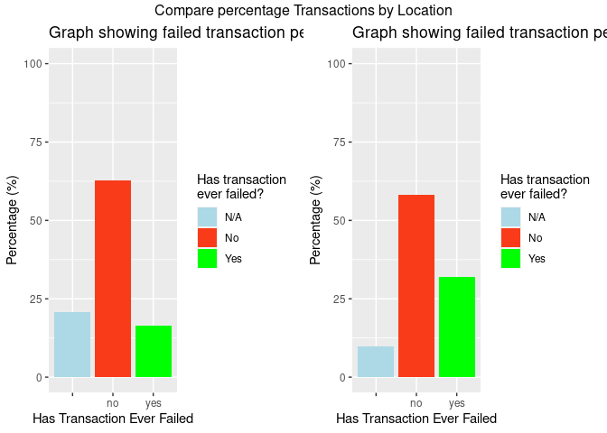

#### Findings

There is a difference in the share of customers who have experienced
failed mobile money transactions in rural and urban villages. 32% of
transactions in urban locations have failed before while 16% of
transactions in rural areas have failed before. However, to determine if
it is statistically significant, hypothesis testing has to be done. Let
us assume a 0.05 (5%) level of significance. We can state null and
alternate hypothesis as:

-   H0: There is no difference in the share of customers who have
    experienced failed mobile money transactions in rural and urban
    villages.
-   Ha: There is a difference in the share of customers who have
    experienced failed mobile money transactions in rural and urban
    villages.

### Hypothesis Testing

Based on the type of data, we perform a two-proportions z-test. This
test function gives us the value of Pearson’s chi-squared test
statistic, a p-value, a 95% confidence intervals and an estimated
probability of success (the proportion of failed mobile money
transactions in the two locations)

``` r
mmdf2 %>%
  count(hh_location, txn_ever_failed) %>% 
  filter(txn_ever_failed == 'yes')
```

    ##   hh_location txn_ever_failed   n
    ## 1       Rural             yes 155
    ## 2       Urban             yes  85

``` r
mmdf2 %>% 
  count(hh_location)
```

    ##   hh_location   n
    ## 1       Rural 940
    ## 2       Urban 265

``` r
prop.test(x = c(155, 85), #number of failed mobile money transactions for each location
          n = c(940, 265), #number of customers at each location
          correct = FALSE #Remove the Yates continuity correction
          )
```

    ## 
    ##  2-sample test for equality of proportions without continuity correction
    ## 
    ## data:  c(155, 85) out of c(940, 265)
    ## X-squared = 31.485, df = 1, p-value = 0.0000000201
    ## alternative hypothesis: two.sided
    ## 95 percent confidence interval:
    ##  -0.21686129 -0.09486091
    ## sample estimates:
    ##    prop 1    prop 2 
    ## 0.1648936 0.3207547

The z-test shows a p-value of 0.0000000201. The p-value is less than our
predetermined significance level of 0.05. Thus we can say the test is
consistent with our hypothesis that there is a difference in share of
customers who have experienced failed mobile money transactions in rural
and urban villages. Nevertheless, there are limitations to this figures
due to the number of customers that did not give records of if their
transactions failed or not.

## What variables are good predictors that someone will cancel their mobile money account?

``` r
# Filter data by number of active mobile money accounts and number of mobile money accounts that have been cancelled

mm_acc_cancled <- mmdf2 %>% 
  filter(mm_account_cancelled == 'yes')

mmTrue <- mmdf2 %>% 
  filter(mobile_money == 'TRUE')

mm_acc_cancled %>% 
  group_by(mm_trust) %>% 
  summarise(n = n())
```

    ## # A tibble: 3 × 2
    ##   mm_trust     n
    ##   <chr>    <int>
    ## 1 ""          14
    ## 2 "no"       151
    ## 3 "yes"       14

``` r
ggplot(aes(x = district, fill = hh_location), data = mmdf2) +
  geom_histogram(stat = 'count') +
  scale_fill_manual(values = c("brown", "#AB9B98")) +
  labs(title = 'location of customers per district') +
  guides(fill=guide_legend(title="Customer location"))
```

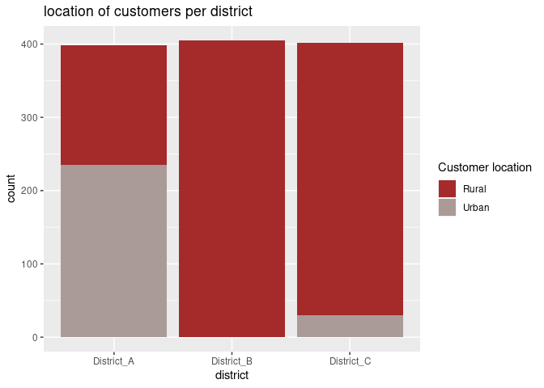

``` r
ggplot(aes(x = district, fill = district), data = mm_acc_cancled) +
  geom_histogram(stat = 'count') +
  scale_fill_manual(values = c("green", "#F93B19", "#AB9B98")) +
  labs(title = 'number of mobile money accounts cancelled by district')
```

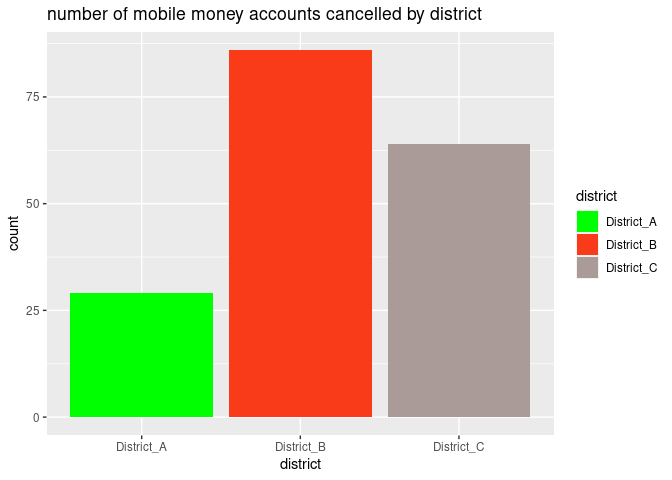

``` r
ggplot(aes(x = mm_trust, fill = agent_trust), data = mmdf2) +
  geom_histogram(stat = 'count') +
  labs(title = 'Trust Levels for Mobile Money and Mobile Money Agents', x = 'Do you trust mobile money?') +
  guides(fill=guide_legend(title="Do you trust \nmobile money agents?")) +
  scale_fill_manual(values = c("#ADD8E6", "#F93B19", "green"),
                    labels = c("N/A", "No","Yes"))
```

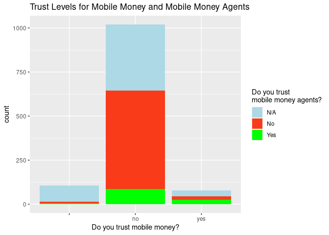

``` r
mm_users <- ggplot(aes(x = mm_trust, fill = agent_trust), data = mmTrue) +
  geom_histogram(stat = 'count') +
  ylim(0, 600) +
  scale_fill_manual(values = c("#ADD8E6", "#F93B19", "green"),
                    labels = c("N/A", "No","Yes")) +
  guides(fill=guide_legend(title="Do you trust \nmobile money agents?")) +
  labs(title = 'Graph of customers using mobile money \nwho dont trust mobile money and mobile money agents', x = 'trust mobile money?')

mm_canc <- ggplot(aes(x = mm_trust, fill = agent_trust), data = mm_acc_cancled) +
  geom_histogram(stat = 'count') +
  ylim(0, 600) +
  scale_fill_manual(values = c("#ADD8E6", "#F93B19", "green"),
                    labels = c("N/A", "No","Yes")) +
  guides(fill=guide_legend(title="Do you trust \nmobile money agents?")) +
  labs(title = 'Graph of customers who cancelled their mobile money account and \ndont trust mobile money and mobile money agents', x = 'trust mobile money?')

#compare for both mm users and those cancelled
grid.arrange(mm_users, mm_canc, ncol=2, top = 'Compare mobile money customers that dont trust mobile money and mobile money agents')
```

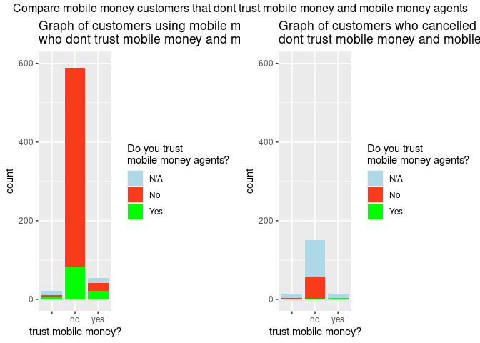

#### From the charts provided above, the following insights can be made

-   All customers in District B are in rural locations while most
    customers in District C are in rural locations.
-   District A had the least number of mobile money accounts cancelled
    while district B had the highest number of mobile money accounts
    cancelled.
-   Majority of customers don’t trust mobile money or mobile money
    agents.
-   Out of the majority of customers that don’t trust mobile money or
    mobile money agents, only a few (179) cancelled their mobile money
    accounts.
-   Of the 179 customers who cancelled their mobile money accounts, 151
    don’t trust the mobile money platform (about 84.36%).

#### As a result of these insights, trust in mobile money and mobile money agents are variables that are good predictors that someone will cancel their mobile money account. Location slightly matters.

## What causes a customer to stop using their mobile money account?

``` r
ggplot(aes(x = prefer_cash), data = mmdf2) +
  geom_histogram(stat = 'count') +
  labs(x = 'prefer cash?')
```

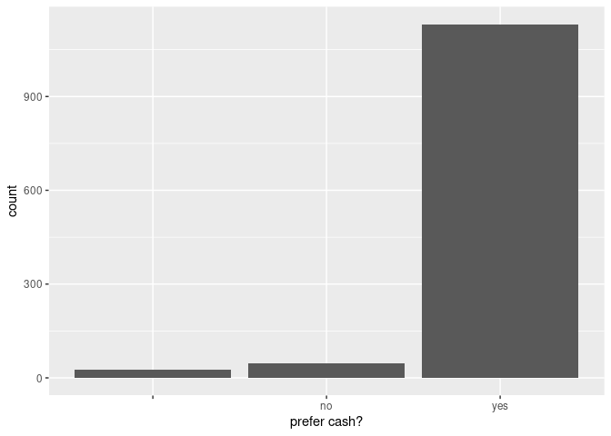

``` r
ggplot(aes(x = understand_data_mm_providers_collect, fill = have_copy_of_terms_nd_cond), data = mmdf2) +
  geom_histogram(stat = 'count') +
  scale_fill_manual(values = c("white", "#F93B19", "#AB9B98"),
                    labels = c("N/A", "No","Yes")) +
  labs(x = 'Do you understand what data mobile money providers collect about you?') +
  guides(fill=guide_legend(title="Do you have a copy of the \nmobile money terms and conditions?"))
```

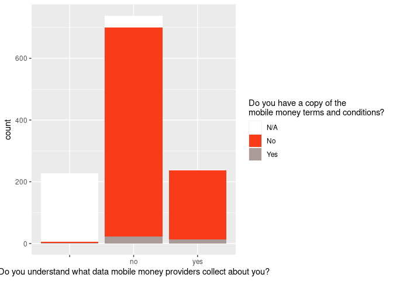

#### It is noted that a vast majority of customers prefer cash. Furthermore, majority do not have a copy of the mobile money terms and conditions in addition to not understanding what data mobile money providers collect about them. Thus, one can assume that customers lack of trust in data collection and conditions of mobile money use, coupled with a preference for the cash option are factors that can cause a customer to stop using their mobile money account

# Key Findings and Summary

### Plot One

    ## # A tibble: 2 × 3
    ##   mobile_money number mm_percen
    ##   <chr>         <int>     <dbl>
    ## 1 FALSE           378      31.4
    ## 2 TRUE            827      68.6

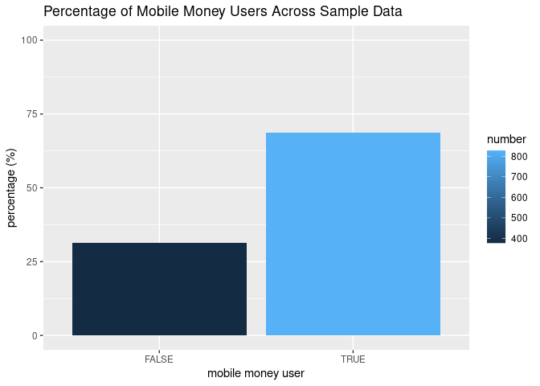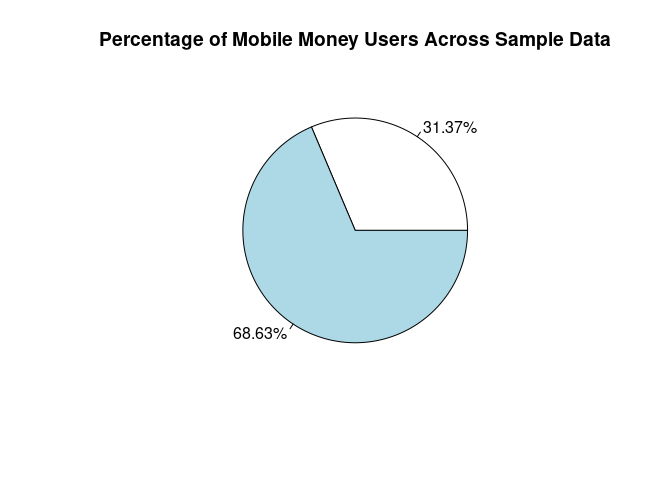
\### Description Mobile money customers account for approximately 68.7%
of the sample data. This suggests that the use of mobile money is
popular among customers.

### Plot Two


    ##   location total_mm_users total_customers mm_users_percen
    ## 1    Rural            601             940           63.94
    ## 2    Urban            226             265           85.28

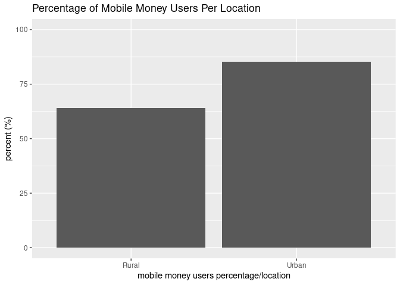
\### Description Customers in the rural locations are significantly more
than those in the urban locations. However, the percentage of customers
using mobile money is higher in urban locations with 85.28% of customers
in urban locations using mobile money and 63.94% of customers in rural
locations using mobile money.

### Plot Three


### Description Three

Majority of customers do not understand what data mobile money providers
collect about them, neither do they have a copy of the mobile money
terms and conditions. This portends great risk as unscrupulous elements
amongst the providers could take advantage of the development to breach
data privacy thereby violating the rights of customers.

## Recommendations

-   Sensitization as well as access to mobile money services and other
    digital financial services should be sustained and intensified,
    following the wide use of mobile money amongst the populace.

-   The urban locations in particular should be exploited as they are
    more receptive to mobile money.

-   Although the majority of customers have their issues properly
    handled in a satisfactory way, the National Bank of Kenya should
    ensure to keep these customers satisfied. Reward programs and
    discounts could be introduced to to ensure the customers remain
    loyal.

-   Mobile Money companies should be properly monitored by the
    Regulatory Authorities to ensure they are not involved in breach of
    data privacy and other related issues.

-   NGO’s focusing on access to digital financial services and
    associated consumer protection issues should promote sensitization
    campaigns for customers so they are aware of data privacy and
    policies of digital financial services.

## Limitations of the Data

-   A lot of customer information critical to accurate analysis was
    missing in the data. Many questions asked in the survey were not
    answered by participating customers.

------------------------------------------------------------------------
